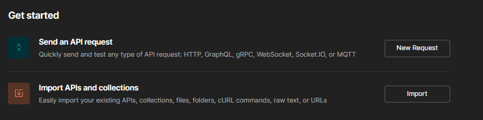
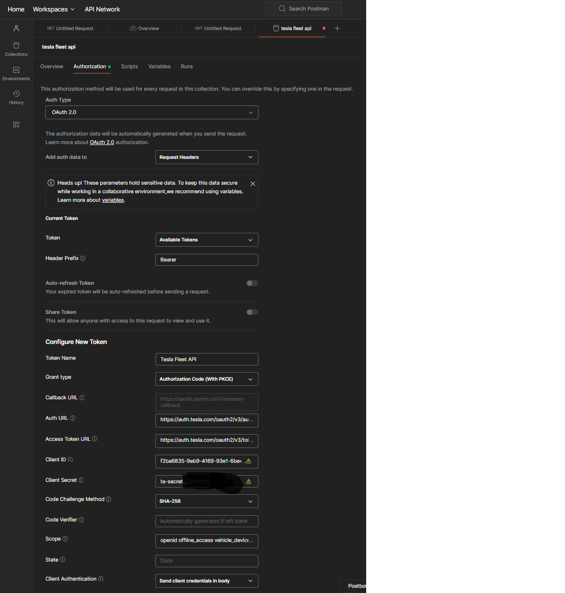
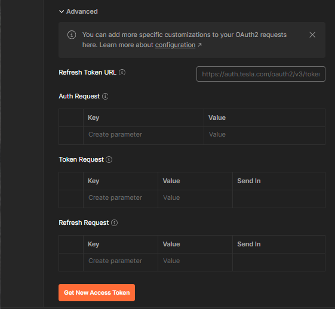
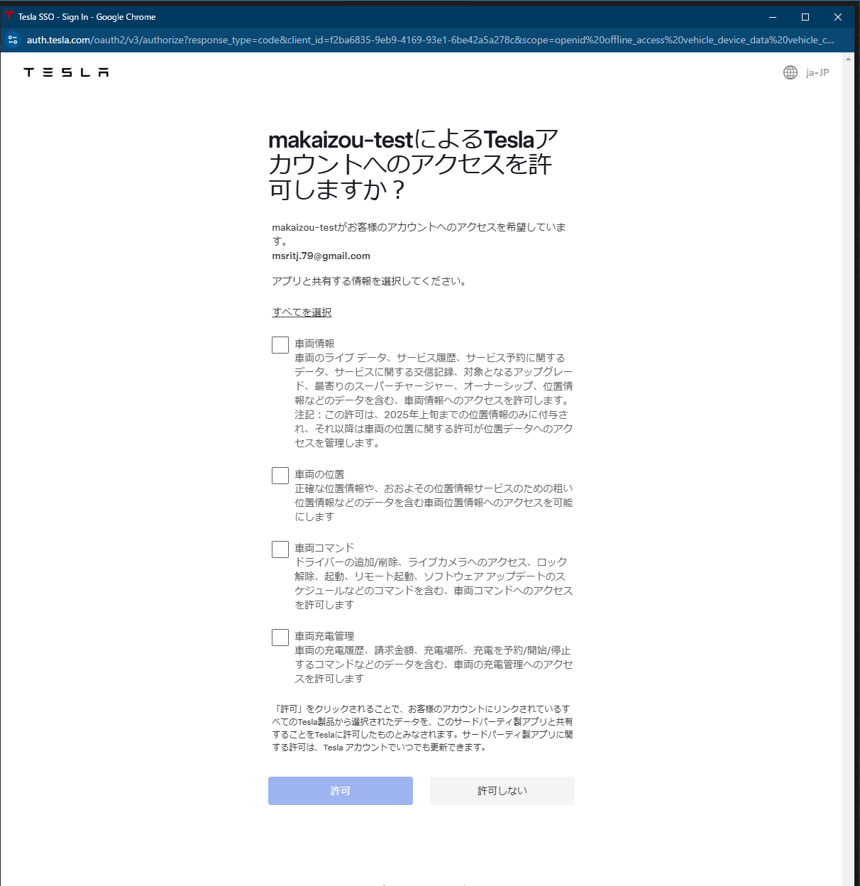
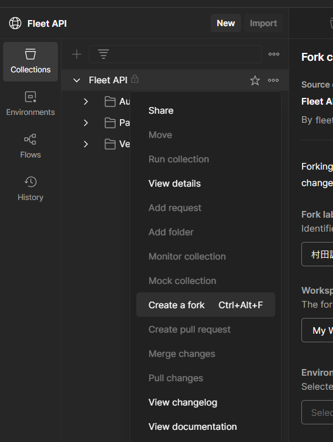
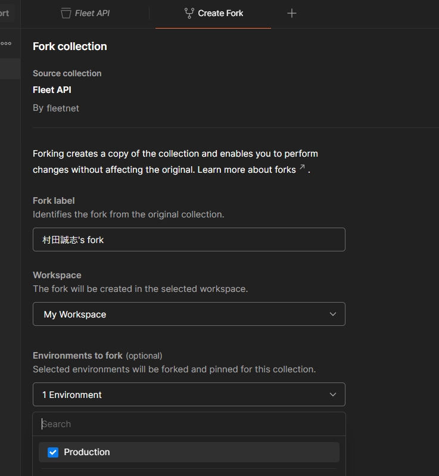
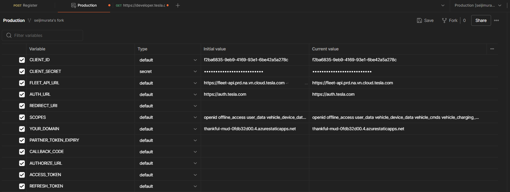

# 0109
## 以下を参考に、TeslaAPIをテストする
基本[2]を見て進める（日本語なのと説明丁寧なので）


[1]公式 https://developer.tesla.com/docs/fleet-api/authentication/partner-tokens
[2] https://www.cdata.com/jp/blog/tesla-fleet-api-postman
[3] https://shankarkumarasamy.blog/2023/10/29/tesla-developer-api-guide-account-setup-app-creation-registration-and-third-party-authentication-configuration-part-1/

### 全体の流れ
[2]の章にそって全体の流れを説明しておく
1. テスラアカウントの作成：事業者用アカウント作成
2. アプリケーションリクエストの作成：アプリ作成してTeslaに申請
3. Public Key・Private Key ペアを作成・ホストする：アプリ認証（API利用時に必要）用の鍵ペアを作成して、Teslaサーバが取得できるように、公開鍵をWebサーバに配置する
4. サードパーティトークンを生成：クライアントに認可要求してトークン取得
5. API を使って車両データを取得・操作をしてみる：トークン使ってAPI利用

以降はわかりにくいところだけ説明する

### 3. Public Key・Private Key ペアを作成・ホストする
鍵をホスティング後、"POST /api/1/partner_accounts"というAPIでWebサーバのドメインを登録するが、そのために
[Client Credentials Grant ](https://qiita.com/TakahikoKawasaki/items/200951e5b5929f840a1f#:~:text=4.-,%E3%82%AF%E3%83%A9%E3%82%A4%E3%82%A2%E3%83%B3%E3%83%88%E3%83%BB%E3%82%AF%E3%83%AC%E3%83%87%E3%83%B3%E3%82%B7%E3%83%A3%E3%83%AB%E3%82%BA%E3%83%95%E3%83%AD%E3%83%BC,-RFC%206749%2C)
でアクセストークンを先に取得しておく

#### アクセストークン取得N
今後、[scope](https://developer.tesla.com/docs/fleet-api/authentication/overview#scopes:~:text=Partner%20token.-,Scopes,-Scopes%20are%20used)は使いたいAPIに合わせて変更する必要がある。(アプリ管理画面からも変更できる)

~~Postman使い慣れていないのでコマンドプロンプトで以下を実行~~
Postmanの方が慣れれば速かったので、[こちら](##postman使えば、だいぶ速くできたのでメモ)参照

```
set CLIENT_ID=<command to obtain a client_id>
set CLIENT_SECRET=<secure command to obtain a client_secret>
set AUDIENCE="https://fleet-api.prd.na.vn.cloud.tesla.com"

curl --request POST ^
  --header "Content-Type: application/x-www-form-urlencoded" ^
  --data-urlencode "grant_type=client_credentials" ^
  --data-urlencode "client_id=%CLIENT_ID%" ^
  --data-urlencode "client_secret=%CLIENT_SECRET%" ^
  --data-urlencode "scope=openid vehicle_device_data vehicle_cmds vehicle_charging_cmds" ^
  --data-urlencode "audience=%AUDIENCE%" ^
  "https://fleet-auth.prd.vn.cloud.tesla.com/oauth2/v3/token"
```

レスポンス
```
{"access_token":"eyJ...........","expires_in":28800,"token_type":"Bearer"}
```

##### 補足
* 公式を見ると[トークンの種類](
https://developer.tesla.com/docs/fleet-api/authentication/overview#:~:text=Authorization%3A%20Bearer%20%3Ctoken%3E-,Token%20Types,-There%20are%20four)には3つあり、~~thirdPartyかpartnerか微妙だが、[2][3]ではpartnerでやっているので、それに従ってみる~~
→API利用登録にはpartner authentication tokenを使うとのこと。
（third party tokenはユーザ認可取得するときに使う）

* [2][3]で用意されているコマンドはパスが違う気がするので、[1]で用意されているコマンドに変更した


#### トークンを使ってWebサーバのドメインを登録

```
set PARTNER_AUTHENTICATION_TOKEN=<取得したaccess token>

curl --header "Content-Type: application/json" ^
  --header "Authorization: Bearer %PARTNER_AUTHENTICATION_TOKEN%" ^
  --data "{\"domain\":\"thankful-mud-0fdb32d00.4.azurestaticapps.net\"}" ^
  "https://fleet-api.prd.na.vn.cloud.tesla.com/api/1/partner_accounts"

```

レスポンス
```
{"response":{"account_id":"56acxxxxxxxxxxxxxx","domain":"thankful-mud-0fdb32d00.4.azurestaticapps.net","name":"makaizou-test","description":"app for makaizou project","client_id":"f2ba68xxxxxxxxxx","ca":null,"created_at":"2024-12-14T15:34:07.581Z","updated_at":"2024-12-15T00:01:06.920Z","enterprise_tier":"pay_as_you_go","issuer":null,"csr":null,"csr_updated_at":null,"public_key":"04b1bd2da1aa3b813523d88a7906b9ef9a43fdaf44de05436c7e7e9343fdd8851c92bb562c2d14d82a9e0f9c2cce8413776b05443b798f03a49072fd1e16e15e45"}}
```

##### 補足
* windowsではシングルクオーテーションを使えない、Jsonの中でダブルクオーテーションを使うときは\"にするという注意が必要。

* 当初以下のようなエラーが出たが、別日にやったらいけた。原因不明
{"error":"unsupported issuer"}

### 4. サードパーティトークンを生成
参考：[作成済みpostman](###Third-Party-Token取得)
ここだけPostmanを利用した。PKCE付きのOAuthでトークン取得を簡単にできるみたいなので。
PostmanでWorkspaceつくって以下のNewRequestを押す



以下の情報を入力してGetNewAccessTokenを押す




認可画面が表示され、トークン取得できる


##### 補足
[公式のThirdPartyToken発行の流れ](https://developer.tesla.com/docs/fleet-api/authentication/third-party-tokens)は以下だが、Postmanはまとめてやってくれる
* Step1 ユーザ認可要求（[OAuth](https://qiita.com/TakahikoKawasaki/items/200951e5b5929f840a1f#:~:text=%E5%85%AC%E9%96%8B%E3%81%97%E3%81%BE%E3%81%97%E3%81%9F%EF%BC%81-,1.%20%E8%AA%8D%E5%8F%AF%E3%82%B3%E3%83%BC%E3%83%89%E3%83%95%E3%83%AD%E3%83%BC,-RFC%206749%2C)の②~⑤）
* Step2 Callbackでredirect_uriから認可コード取得(OAuthの⑥)
* Step3 認可コードからThirdPartyTokenを取得(OAuthの⑦⑧)

次回以降はリフレッシュトークンで再発行する（リフレッシュトークンは24hごとに更新される）

~~この認可APIではパラメータがclient_idだけで、事業者アカウントと同じメールで紐づいたTeslaオーナーアカウント＝事業者本人にしか認可要求を出せない。そのため、第三者の事業者が、他人の車両にアクセスすることはできないっぽい（メールで問合せ中）~~
→ 認可もらいたいユーザに認可要求のURLを送り、そのアカウントでログインしてもらって認可してもらえばOK
（事業者アカウントとオーナーアカウントがどのように紐づいているかは不明）


# 0111
## postman使えば、だいぶ速くできたのでメモ
[公式のpostmanリンク](https://developer.tesla.com/docs/fleet-api/authentication/overview#:~:text=A%20Postman%20collection%20with%20these%20requests%20can%20be%20found%20here.)

[makaizouのworkspace](https://makaizou.postman.co/workspace/makaizou~f60e0433-9a3e-4ce1-ac56-8c325bcf08a9/collection/40437256-c0a31a51-fdc0-444f-8aef-39e0df6b3b08?action=share&creator=40437256)
[makaizouの招待リンク](https://app.getpostman.com/join-team?invite_code=53380819f0c4b829be7995cf20c37c5bd6fa9cbaf143c307c21b1d40db032218)

### FleetAPIを自分のworkspaceにコピー
create a fork -> Environmentを選択 -> fork collections



以下は自分のworkspace上で
### environmentの設定

作業進めていくと得られたtokenなどから自動で環境変数を更新してくれる（postmanのtestスクリプトから自動更新される）

### collectionの部分を順番に作業
Generate Partner Token -> Register

### Third Party Token取得
[third party token取得のpostman](https://makaizou.postman.co/workspace/f60e0433-9a3e-4ce1-ac56-8c325bcf08a9/folder/40437256-1fc5891f-dd4a-47d7-bf6e-3f85a7e5f8c1?action=share&source=copy-link&creator=40437256&ctx=documentation)
は公式ではなかったので自作した。

# 0113
command側はセキュリティ強化のため、車両アクセス時に車両側でアプリ認証を行う。
追加でいろいろセットアップが必要

公式：https://developer.tesla.com/docs/fleet-api/endpoints/vehicle-commands#:~:text=Vehicle%20commands%20allow%20direct%20interaction%20with%20a%20vehicle.%20To%20accept%20commands%2C%20a%20vehicle%20must%20have%20an%20application%27s%20Fleet%20Key%20installed.%20The%20command%20must%20be%20sent%20through%20the%20Vehicle%20Commands%20Proxy%20to%20send%20commands.
公式：https://github.com/teslamotors/vehicle-command

https://shankarkumarasamy.blog/2024/01/28/tesla-developer-api-guide-ble-key-pair-auth-and-vehicle-commands-part-3/
https://shankarkumarasamy.blog/2024/02/25/tesla-developer-api-guide-http-proxy-server-integration-part-4/
