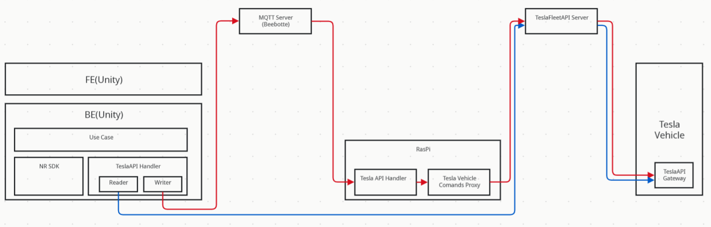
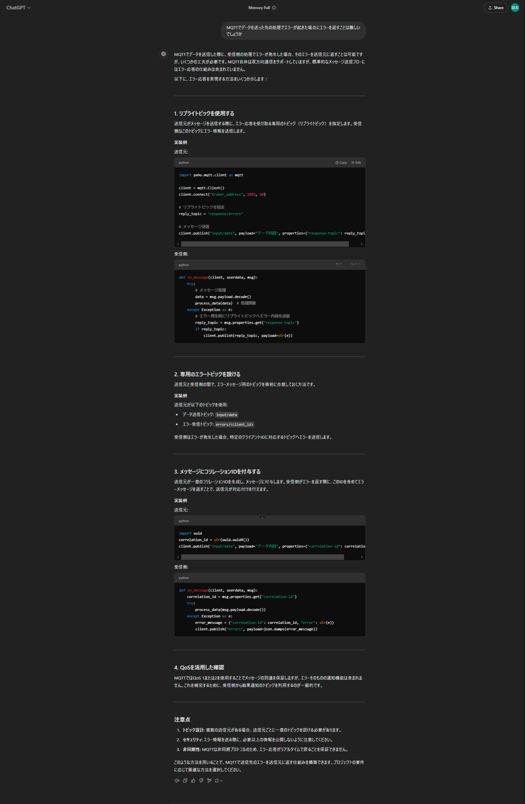
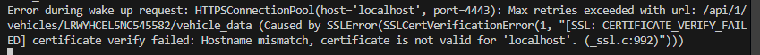
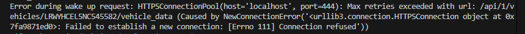
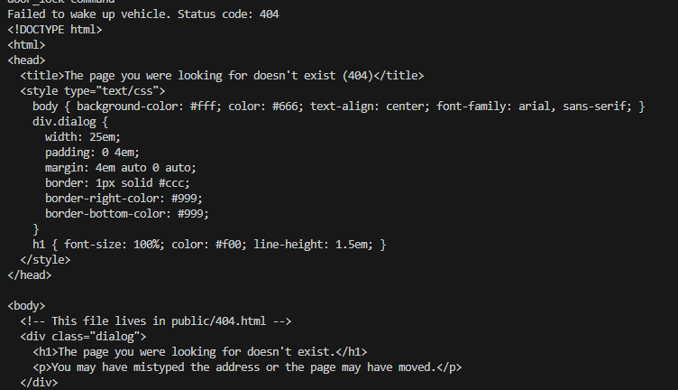

このページではUnity向けにTeslaAPIをたたくIFの実装を進めたときのメモを記載
実装はTeslaAPIHanlderディレクトリ配下にある

# 0122
## C#でRead系APIをたたくIFを実装
Read系APIは特に問題なくRESTAPIを呼ぶだけ

## write系APIの動作確認
WindowsPC上でプロキシサーバ（VehicleCommandProxy）立てて他PCからアクセス
→ 接続がうまくいかず、ファイアウォールの設定を変更してもうまくいかない。変えられないセキュリティによるものと思われる。
→ ラズパイでプロキシサーバを立てて他PCからアクセス
（サーバ立てるコマンドでlocalhostに立てるが、127.0.0.1だと自分のデバイスからしかアクセスできない。0.0.0.0とすると他からもアクセスできる）

→ うまくいったが、SSL証明書に記載されているアクセス先（localhost）と実際のアクセス先（ラズパイのIP）が異なっているというエラーでアクセスできない
→ -kのオプションをつけることで回避できる。ほんとは良くない気がするが
```
 curl --cacert ./config/tls-cert.pem --header "Authorization: Bearer $TESLA_AUTH_TOKEN" -k "https://192.168.218.107:4443/api/1/vehicles/$VIN/vehicle_data" | jq -r .                             
 ```

## 設計検討
懸念：PCからアクセス時にIPアドレス指定だと少し面倒な気がする。（-kで回避したところが問題ないかも懸念）
理由
* ネット環境やラズパイが変わってIPが変わったときに、柔軟に対応できないので。
  * IPが変わる度にapkをつくるとかはやりたくない
  * UI上でIP入力するようにできなくないが、Unityチームとの動作確認に時間かかるなどのリスクがあるので。

対応：
* 方針：Unityからネットワーク環境に左右されない、PtoPではない方法でラズパイに信号を送る。ラズパイのローカルに立てたプロキシサーバからTeslaAPIたたく。
（セキュリティ的にもローカルからしかAPIたたけないほうが安全なので）

* Unityアプリとラズパイの通信方法：MQTTがよさそう
  （前使って慣れているのと、通信速度速いのと、公開サーバをブローカーとして使えばIPによらずに使えるので）

設計
Unity -> MQTT broker(beebotte server) -> tesla vehicle Commands Proxy on RasPi -> tesla Fleet API -> vehicle
（Unity -> AWS MQTT -> AWS上に立てたプロキシ -> FleetAPI という方法だとやりやすいかも。今後Tryしてみたい）



# 0125
## C#でMQTT経由でWrite系APIをたたくIFを実装
MQTTは基本pub/subだがreq/resはどうするか？今回はwriteAPIたたいたときにエラーだけは返したい。
仕組みとしては以下のようにerrorのトピックを用意すればよい。apiの種類ごとには用意しなくていいかな
https://www.ogis-ri.co.jp/column/iot/column/c106661.html

→一旦確認簡単な2で進める


C#のMQTTnetライブラリはver5だと互換性なく動かないので注意
https://stackoverflow.com/questions/76359009/missing-mqttnet-client-namespaces-after-upgrading-to-the-latest-version-any-so

# 0127
## ラズパイ上のプログラムtesla-api-proxy
python requestsライブラリを使ったプロキシ経由のREST送信だと以下のようなエラーが出て動かない。
↓ Caused by SSLError localhostの証明に失敗


↓ 別のポート指定: Caused by NewConnectionError


今回は妥協策として、http.clientのライブラリを使用。
→うまくいかない


curlコマンドをsubprocessで実行
→うまくいった。上記の原因わからん。。。


